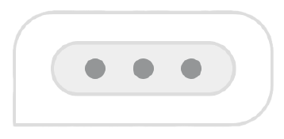

# @suppsalismjs/chatbot

<a href="https://github.com/suppsalism/chatbot">
	
</a>

[](https://www.npmjs.com/package/@suppsalismjs/chatbot)
[](https://bundlephobia.com/package/@suppsalismjs/chatbot)
[](https://www.npmjs.com/package/@suppsalismjs/chatbot?activeTab=dependencies)
[](./LICENSE.md)

A chat widget UI for any web page. You supply one function that returns the
reply — this package builds the widget, renders it, and runs every interaction.

## Quick start

### CDN

```html
<script>
  window.ssChat = window.ssChat || [];
  ssChat.push([
    'defineChatElement',
    {
      onSendMessage: async (message) => {
        const res = await fetch('/api/chat', {
          method: 'POST',
          headers: { 'Content-Type': 'application/json' },
          body: JSON.stringify({ text: message.text }),
        });
        return (await res.json()).reply;
      },
    },
  ]);
</script>
<script
  src="https://cdn.jsdelivr.net/npm/@suppsalismjs/chatbot@1/dist/chatbot.umd.js"
  defer
></script>

<ss-chat data-name="Assistant" data-theme="dark"></ss-chat>
```

### npm

```bash
npm install @suppsalismjs/chatbot
```

```js
import { createChatbot } from '@suppsalismjs/chatbot';

const bot = createChatbot({
  name: 'Assistant',
  initialMessages: ['Hi! How can I help?'],
  onSendMessage: async (message) => {
    const res = await fetch('/api/chat', {
      method: 'POST',
      body: JSON.stringify({ text: message.text }),
    });
    return (await res.json()).reply;
  },
});
```

No backend handy? `echoReply` ships with the package:

```js
import { createChatbot, echoReply } from '@suppsalismjs/chatbot';

createChatbot({ onSendMessage: echoReply });
```

## Why this package

Most chat widgets bundle a UI _and_ a backend integration, so adopting one means
adopting its network layer, its auth model, and its opinions about where your
data lives.

This one ships the UI and the state and nothing else — it makes no network calls
of any kind, and no API keys, endpoints, or base URLs appear anywhere in its
config. Sending a message, persisting it, and authenticating the request are
your code, passed in as a callback, so the same widget works against your own
API route, a hosted LLM, a local model, or a mock in a test.

## Two ways to use it

`createChatbot()` and `defineChatElement()` are the only two ways to drive the
widget, and both are exposed identically whether you got the package from npm or
the CDN — `SsChat.createChatbot` is the same function as the npm import, not a
reduced variant. Everything after this section applies to both equally.

|                           | `createChatbot()`                                                | `defineChatElement()` + `<ss-chat>`                                                       |
| ------------------------- | ---------------------------------------------------------------- | ----------------------------------------------------------------------------------------- |
| You call                  | `createChatbot(options)` directly, wherever you want it to mount | `defineChatElement(options)` **once**, anywhere — the tag does the rest                   |
| Configuration             | Passed as a JS object                                            | Per-instance `data-*` attributes on each tag, over shared defaults passed at registration |
| Mounting                  | You decide when                                                  | Automatic, the instant the tag is connected to the DOM                                    |
| `destroy()`               | You call it yourself                                             | Automatic, the instant the tag is removed from the DOM                                    |
| `updateConfig()`          | You call it yourself                                             | Automatic, the instant a `data-*` attribute changes                                       |
| Getting the instance back | Returned directly from the call                                  | Via `tag.bot` or the `ss-chat:ready` event                                                |

**Choose `defineChatElement`** when the widget's presence should just follow the
DOM: markup authored by a CMS, a component that mounts and unmounts inside a
larger tree, an SPA route that renders the tag on some pages and not others.

**Choose `createChatbot`** when you need to control exactly when it mounts, or
you're already holding the instance where you created it.

### `createChatbot`

The primitive everything else is built on. Call it, get an instance back, drive
it yourself:

```js
const bot = createChatbot({ onSendMessage });
```

Calling it directly means you own its lifecycle: you decide when and where it
mounts, and you're responsible for `bot.destroy()` when you're done with it and
`bot.updateConfig()` if its config changes later.

### `defineChatElement` and `<ss-chat>`

Not a different engine — a thin adapter that registers a `<ss-chat>` custom
element and calls `createChatbot()` for you, driven by the DOM instead of by
your own function calls:

```js
import { defineChatElement } from '@suppsalismjs/chatbot';

defineChatElement({ onSendMessage });
```

```html
<ss-chat data-theme="dark" data-orientation="left" data-name="Assistant"></ss-chat>
```

Because this is a real custom element registration and not a one-time page scan,
it keeps working as the DOM changes: a tag added later by a framework boots
automatically, and editing an attribute live calls `updateConfig()` for you.

**Callbacks always come through JS, never attributes.** A `data-*` attribute is
always a string, so a function can never be one. Every callback is passed to
`defineChatElement` exactly as it would be to `createChatbot`:

```js
defineChatElement({
  onSendMessage: (message) => fetch('/api/chat', {/* … */}).then((r) => r.json()),
  afterSubmitMessage: (message, reply) => saveMessage(message, reply),
  onOpen: () => trackEvent('chat_opened'),
});
```

Config fields passed here become **shared defaults** for every instance of the
tag, and a tag's own `data-*` attribute wins over them — so two tags on one page
can differ:

```js
defineChatElement({ onSendMessage, theme: 'light' });
```

```html
<ss-chat></ss-chat>
<!-- light, from the shared default -->
<ss-chat data-theme="dark"></ss-chat>
<!-- dark, its own attribute wins -->
```

`tagName` (default `'ss-chat'`) registers a second variant with a different
backend:

```js
defineChatElement({ tagName: 'ss-chat-sales', onSendMessage: toSales });
```

#### Getting the instance from a tag

`defineChatElement` creates the instance for you, so you don't get it from a
return value — but it's fully available two ways, both the same object with the
same [Instance API](#instance-api).

**`tag.bot`** — a getter on the element. Reliable immediately after the tag is
connected to the DOM, since `connectedCallback` runs synchronously on insertion:

```js
document.querySelector('ss-chat').bot.open();
```

**The `ss-chat:ready` event** — dispatched from the tag the moment its instance
is created, and again if the tag is removed and later reconnected, carrying the
instance in `event.detail.bot`. Use this when you don't control when or where the
tag gets inserted:

```js
document.querySelector('ss-chat').addEventListener('ss-chat:ready', (event) => {
  event.detail.bot.open();
});
```

## Configuration

Every field below is optional. Pass it as a camelCase prop to `createChatbot()`
or `defineChatElement()`, or as its kebab-case `data-*` attribute on
`<ss-chat>`. **An invalid value falls back to its default and logs a warning —
it never throws or blanks the widget**, and an unrecognized field is ignored the
same way, so a cached older build never breaks on a config field it doesn't know
yet.

| Prop / attribute                                | Type                | Default             | What it's for                                                                                                           |
| ----------------------------------------------- | ------------------- | ------------------- | ----------------------------------------------------------------------------------------------------------------------- |
| `theme` · `data-theme`                          | `'light' \| 'dark'` | `'light'`           | Color theme inside the chat panel — background, borders, bubble colors                                                  |
| `orientation` · `data-orientation`              | `'left' \| 'right'` | `'right'`           | Which side of the screen the launcher and panel sit on                                                                  |
| `brandColor` · `data-brand-color`               | hex color           | `'#2563eb'`         | Accent color for the launcher, agent-message highlights, and buttons. Text contrast against it is derived automatically |
| `name` · `data-name`                            | `string`            | `'Assistant'`       | Title shown in the panel header                                                                                         |
| `avatar` · `data-avatar`                        | url                 | —                   | Image shown in the header and next to every agent message                                                               |
| `placeholder` · `data-placeholder`              | `string`            | `'Type a message…'` | Placeholder text in the empty composer                                                                                  |
| `initialMessages` · `data-initial-messages`     | `string[]` (JSON)   | `[]`                | Messages rendered before any interaction — e.g. a greeting                                                              |
| `suggestedMessages` · `data-suggested-messages` | `string[]` (JSON)   | `[]`                | Suggestion chips above the composer; tapping one auto-submits it                                                        |
| `signature` · `data-signature`                  | `boolean`           | `true`              | Shows or hides the footer credit                                                                                        |
| `autoOpen` · `data-auto-open`                   | `boolean`           | `false`             | Opens the panel as soon as the widget mounts                                                                            |
| `collectFeedback` · `data-collect-feedback`     | `boolean`           | `false`             | Thumbs up/down under every agent message. Pair with [`onFeedbackSubmit`](#callbacks)                                    |
| `sessionId` · `data-session`                    | `string`            | auto-generated      | Stamped on every lifecycle payload so you can correlate messages to a session in your own backend                       |

Two options are **not** configuration, because neither survives
`JSON.stringify` (see [Design notes](#design-notes)) and so neither has an
attribute equivalent. `<ss-chat>` sets `mount` to itself automatically.

| Option       | Type      | Default         | What it's for                                                                                                                                                                                     |
| ------------ | --------- | --------------- | ------------------------------------------------------------------------------------------------------------------------------------------------------------------------------------------------- |
| `mount`      | `Element` | `document.body` | Decides ownership, not layout. Everything the widget creates is a descendant of it, and `destroy()` tears down exactly that subtree. Must be an attached element — throws synchronously otherwise |
| `instanceId` | `string`  | auto-generated  | Namespaces the DOM ids the widget generates. Pass one only when you need stable selectors for end-to-end tests                                                                                    |

## Message lifecycle

Three stages, correlated by a `messageId` generated once and threaded through all
three. `before` and `after` are purely observational — the middle one is the only
one that produces the reply.

```
user submits
      │
      ├─► beforeSubmitMessage(draft) ────► draft | false
      │        false or throw → nothing renders, composer re-enabled
      │
      ├─► render user bubble, lock composer, show typing indicator
      │
      ├─► onSendMessage(message, ctx) ───► reply | AsyncIterable<chunk>
      │        throw → error bubble rendered, onMessageError called
      │
      ├─► render reply, hide typing, unlock composer
      │
      └─► afterSubmitMessage(message, reply)
```

```ts
interface Message {
  text: string;
  messageId: string;   // generated once, identical across all three stages
  sessionId: string;
  timestamp: number;
}

interface Reply {
  text: string;                  // required
  suggestions?: string[];        // chips for the next turn
  form?: FormSpec;               // a form rendered inside this message
}

type SendResult =
  | Reply                                     // one agent message
  | Reply[]                                   // one agent message per element
  | string                                    // shorthand for { text }
  | AsyncIterable<string | { text: string }>; // streamed into a single bubble

interface SendContext {
  history: readonly Message[];   // the conversation so far
  config: Readonly<Config>;      // the current resolved config
}

beforeSubmitMessage?: (draft: Message) => Message | false | Promise<Message | false>;

onSendMessage:        (message: Message, ctx: SendContext) =>
                        SendResult | Promise<SendResult>;

afterSubmitMessage?:  (message: Message, reply: Reply | Reply[]) => void | Promise<void>;
```

All three are passed through the JS options object — a function can never be an
HTML attribute, so none of them has a `data-*` equivalent.

### `beforeSubmitMessage`

Optional. Runs before anything renders. Return a modified draft to transform it
— trim, filter, attach page context — or `false` to cancel, in which case the
message never appears in the conversation at all.

```js
beforeSubmitMessage: (draft) => {
  if (draft.text.length > 2000) return false; // cancelled, nothing renders
  return { ...draft, text: draft.text.trim() };
};
```

### `onSendMessage`

**Required** — the one function you must supply, since this package is pure UI
and can't produce a reply on its own. Omitting it throws at construction rather
than leaving you with a widget that silently accepts messages and does nothing.

Return a string, a reply object, an **array of reply objects** for several
bubbles in one turn, or an async iterable to stream chunk by chunk into a single
bubble:

```js
// simplest
onSendMessage: (message) => 'Thanks for reaching out!'

// with suggestion chips for the next turn
onSendMessage: async (message) => ({
  text: 'Which plan are you on?',
  suggestions: ['Free', 'Pro', 'Enterprise'],
})

// several messages in one turn — one bubble per element
onSendMessage: async (message) => [
  { text: 'Got it.' },
  { text: "Here's what I found." },
  { text: 'Anything else?' },
]

// streamed
onSendMessage: async function* (message, { history }) {
  const res = await fetch('/api/chat', {
    method: 'POST',
    body: JSON.stringify({ history }),
  });
  for await (const chunk of res.body.pipeThrough(new TextDecoderStream())) {
    yield chunk;
  }
}
```

Each element of an array becomes its own message — its own bubble, its own
`messageId`, its own feedback buttons, its own conversation entry. Suggestion
chips are a single row, so if several elements carry `suggestions`, the last
non-empty set wins. A streamed reply is always one bubble and carries no form.

`ctx.history` is a read-only snapshot of the conversation, and `ctx.config` is
the current resolved config — read from it rather than closing over a value that
may go stale after `updateConfig()`.

### Forms

Any reply can carry a `form`, rendered inside that message's bubble. This is how
you collect anything from a visitor — an email, a phone number, a plan choice —
at the moment in the conversation where it makes sense, rather than from a
permanent form bolted to the panel.

```js
onSendMessage: async (message) => ({
  text: 'Happy to help! Mind sharing where to reach you?',
  form: {
    title: 'Please share your name and email so we can follow up with you later.',
    submitLabel: 'Send',
    fields: [
      { name: 'name', label: 'Name', required: true },
      { name: 'email', label: 'Email', type: 'email', required: true },
      { name: 'note', label: 'Anything else?', type: 'textarea' },
    ],
    onSubmit: async (values) => {
      await saveLead(values); // { name, email, note }
      return { text: "Thanks! We'll be in touch." }; // answers in the conversation
    },
  },
});
```

**The handler lives on the form itself.** There is no widget-level
`onFormSubmit`, because each form knows what it is for — the code that consumes
the values sits next to the fields that produce them, and you never dispatch on
an id you had to invent.

```ts
interface FormSpec {
  fields: FormField[]; // required
  title?: string; // text above the fields
  submitLabel?: string; // button text; defaults to 'Send'
  id?: string; // comes back as ctx.formId; defaults to the message's id
  onSubmit?: (
    values: FormValues,
    ctx: FormContext
  ) =>
    | void // lock the form
    | false // leave it editable — a server-side rejection
    | SendResult // answer in the conversation, then lock
    | Promise<void | false | SendResult>;
}

interface FormField {
  name: string; // required — the key this field's value gets in `values`
  label?: string; // defaults to `name`
  type?: 'text' | 'email' | 'tel' | 'url' | 'number' | 'textarea' | 'select' | 'checkbox'; // defaults to 'text'
  required?: boolean; // enforced by the browser, not by this package
  placeholder?: string;
  value?: string | boolean; // prefill; boolean for a checkbox
  options?: Array<string | { value: string; label?: string }>; // `select` only
}

type FormValues = Record<string, string | boolean>; // checkboxes are booleans

interface FormContext {
  formId: string; // the form's `id`, or the message's id
  messageId: string; // the agent message the form is attached to
  sessionId: string;
}
```

`fields` is the only required key, and every field needs a `name`. An unknown
`type` degrades to `text` with a warning.

`onSubmit(values, ctx)` receives the values keyed by field name — checkboxes as
booleans, everything else as strings — and `ctx` of
`{ formId, messageId, sessionId }`. What you return decides what happens next:

| Return                          | Effect                                                                |
| ------------------------------- | --------------------------------------------------------------------- |
| a reply, or an array of replies | Rendered as new agent messages, and the form locks                    |
| `false`                         | The form stays editable — use this to reject a submission server-side |
| anything else                   | The form locks, nothing is rendered                                   |

Locking is what stops the same lead being submitted twice. **Validation is
native** — `required` and `type="email"` are enforced by the browser, so there
is no validation engine here and no regex config.

There is no `password` field type, deliberately. A reply can be described by
your backend or by a model, and a password prompt rendered inside a brand's own
chat widget is a credible phishing surface with no legitimate use. An invalid
field is dropped with a warning and the rest of the form still renders, so one
bad field never costs you the whole reply.

#### Multi-step flows

`onSubmit` returns the same shape `onSendMessage` does, and a reply can carry a
form — so **a form can answer with another form**. That's all a multi-step flow
is; there's no wizard API to learn:

```js
const step2 = {
  text: 'Great. When suits you?',
  form: {
    fields: [{ name: 'slot', type: 'select', options: ['Morning', 'Afternoon'] }],
    onSubmit: (values) => bookSlot(values).then(() => ({ text: 'Booked — see you then.' })),
  },
};

onSendMessage: async () => ({
  text: 'Want to book a demo?',
  form: {
    fields: [{ name: 'email', label: 'Email', type: 'email', required: true }],
    onSubmit: (values) => (saveLead(values), step2), // ← returns the next step
  },
});
```

Each step is its own message, so earlier steps stay visible and locked above the
current one — a readable record of what was asked and answered. Depth is bounded
by the user actually submitting each step, so "a form returning a form" is a
chain of separate turns, not recursion. There is no built-in Back button; if you
want one, return an earlier step from a later `onSubmit`.

#### When the form is described by your backend

JSON has no functions, so a reply you return straight from `fetch` can describe
a form but cannot carry its handler. Attach it on the way through — this is the
canonical shape for a server-driven conversation:

```js
const handlers = {
  lead: (values) => saveLead(values),
  booking: (values) => bookDemo(values),
};

onSendMessage: async (message) => {
  const reply = await (await fetch('/api/chat')).json();
  if (reply.form) reply.form.onSubmit = handlers[reply.form.id];
  return reply;
};
```

**This package never retries a failed send.** Retries, backoff, and timeouts
belong here, since only you know which failures are safe to repeat.

### `afterSubmitMessage`

Optional. Fires once the reply is fully rendered — for a streamed reply, after
the last chunk. Fire-and-forget: a throw here is caught and routed to
`onMessageError` and can never break the chat, which makes it the natural place
for persistence and analytics.

```js
afterSubmitMessage: (message, reply) => {
  saveMessage({ id: message.messageId, role: 'user', text: message.text });
  saveMessage({ replyTo: message.messageId, role: 'agent', text: reply.text });
};
```

## Callbacks

All optional, all fire-and-forget — a throw inside any of them is caught and
routed to `onMessageError` rather than breaking the UI. Like the lifecycle
callbacks above, these are JS-only and have no attribute equivalent.

```ts
onReady?:            (bot: ChatbotInstance) => void;
onOpen?:             () => void;
onClose?:            () => void;
onSuggestionClick?:  (text: string) => boolean | void;
onFeedbackSubmit?:   (feedback: { messageId: string; value: 'up' | 'down' }) => void;
onMessageError?:     (error: Error, message: Message) => void;
```

| Callback             | Fires when                                                      | Notes                                                  |
| -------------------- | --------------------------------------------------------------- | ------------------------------------------------------ |
| `onReady`            | The widget has mounted and is interactive                       | Once per instance                                      |
| `onOpen` / `onClose` | The panel opens or closes                                       | However triggered — a launcher click or `bot.open()`   |
| `onSuggestionClick`  | A suggestion chip is clicked                                    | Return `false` to prevent it from auto-submitting      |
| `onFeedbackSubmit`   | Thumbs up/down is clicked                                       | Only when `collectFeedback` is on                      |
| `onMessageError`     | Any lifecycle error, after it has already been degraded visibly | One place to observe every failure — logging, alerting |

## Instance API

The same object with the same methods whether it came from `createChatbot()`,
`tag.bot`, or the `ss-chat:ready` event.

```ts
interface ChatbotInstance {
  id: string;
  open(): void;
  close(): void;
  toggle(): void;
  submit(text: string): Promise<void>;
  updateConfig(patch: Partial<Config>): void;
  getState(): { open: boolean; messages: Message[]; pending: boolean };
  destroy(): void;
}
```

| Method                      | What it's for                                                                                                                                                                                                                                                                   |
| --------------------------- | ------------------------------------------------------------------------------------------------------------------------------------------------------------------------------------------------------------------------------------------------------------------------------- |
| `open` / `close` / `toggle` | Drive the panel from your own UI — a "Need help?" button elsewhere on the page                                                                                                                                                                                                  |
| `submit`                    | Sends a message on the user's behalf, running the exact same three-stage lifecycle as a typed submission. Use it to seed a conversation with context, or to drive the chat from a composer of your own                                                                          |
| `updateConfig`              | Re-validates, merges, and re-applies a partial config live — theme and brand on both the host page and the panel, header and composer text, sections mounting or unmounting as needed                                                                                           |
| `getState`                  | A snapshot of the current state. Sync your own UI against it — e.g. disable an external button while `pending` is `true`                                                                                                                                                        |
| `destroy`                   | Removes every node the widget created, unbinds every listener, disposes every reactive effect. **Always call this for a `createChatbot()` instance you're done with**, such as on an SPA route change. Not needed for `<ss-chat>`, where it's automatic on removal from the DOM |

## Recipes

### React, Vue, Svelte

The pattern is the same in all three: create on mount, destroy on unmount.

```jsx
// React
import { useEffect, useRef } from 'react';
import { createChatbot } from '@suppsalismjs/chatbot';

function Chat() {
  const el = useRef(null);

  useEffect(() => {
    const bot = createChatbot({ mount: el.current, onSendMessage });
    return () => bot.destroy();
  }, []);

  return <div ref={el} />;
}
```

```vue
<!-- Vue -->
<script setup>
import { onMounted, onUnmounted, ref } from 'vue';
import { createChatbot } from '@suppsalismjs/chatbot';

const el = ref(null);
let bot;

onMounted(() => {
  bot = createChatbot({ mount: el.value, onSendMessage });
});
onUnmounted(() => bot?.destroy());
</script>

<template><div ref="el" /></template>
```

```svelte
<!-- Svelte -->
<script>
  import { onMount } from 'svelte';
  import { createChatbot } from '@suppsalismjs/chatbot';

  let el;
  onMount(() => {
    const bot = createChatbot({ mount: el, onSendMessage });
    return () => bot.destroy();
  });
</script>

<div bind:this={el}></div>
```

### Next.js and SSR

Importing this package has no side effects, so it's safe at module scope in a
server component. `createChatbot` touches the DOM, so call it only after mount:

```jsx
'use client';

useEffect(() => {
  const bot = createChatbot({ onSendMessage });
  return () => bot.destroy();
}, []);
```

There's no need for `dynamic(() => …, { ssr: false })` — nothing in this package
runs on the server unless you call it.

### Applying a remote config without blocking first paint

Render immediately from what you already have, then reconcile when the network
answers. The widget is interactive the whole time, and `updateConfig` re-validates
and merges for you:

```js
const bot = createChatbot({ theme: 'light', onSendMessage });

fetchRemoteConfig().then((remote) => bot.updateConfig(remote));
```

### Driving the widget from your own button

```js
// npm
const bot = createChatbot({ onSendMessage });
document.querySelector('#help').addEventListener('click', () => bot.toggle());
```

```html
<!-- CDN -->
<button onclick="SsChat.instances[0].toggle()">Need help?</button>
```

With a tag, go through `tag.bot`:

```js
document.querySelector('#help').addEventListener('click', () => {
  document.querySelector('ss-chat').bot.toggle();
});
```

## Styling

**The chat panel renders inside an iframe.** That's what makes it look the same
on every site regardless of the host page's CSS — and it also means a CSS rule
you write on the host page cannot reach inside the panel. This surprises people,
so it's worth knowing before you try.

Theming goes entirely through config today — `theme`, `brandColor`, and
`orientation` are the only knobs. There is currently no option to override
individual CSS custom properties from config; if you need deeper visual control
than those three provide, your only option is forking the stylesheet.

The package ships a standalone copy for exactly that:

```js
import '@suppsalismjs/chatbot/style.css';
```

**Importing it changes nothing on its own.** The widget injects its CSS from
inside the JS bundle — it has to, because it styles an iframe document it
creates at runtime and can't rely on the host page having loaded a stylesheet.
This file is a readable reference to fork, not a runtime dependency, and it
concatenates two sheets that are injected into two different documents:
`shell.css` into the host page, `widget.css` into the iframe. They aren't
interchangeable.

## TypeScript

Type declarations ship with the package, generated from JSDoc — no separate
`@types` package, and the library doesn't need to be written in TypeScript for
you to get autocomplete. CDN consumers can install it for types only, without
shipping it at runtime:

```bash
npm i -D @suppsalismjs/chatbot   # types only — the runtime still comes from the CDN
```

```ts
declare global {
  interface Window {
    SsChat: typeof import('@suppsalismjs/chatbot') & {
      version: string;
      instances: ReturnType<typeof import('@suppsalismjs/chatbot').createChatbot>[];
      get(id: string): ReturnType<typeof import('@suppsalismjs/chatbot').createChatbot> | undefined;
    };
  }
}
```

`window.SsChat` is every named export, plus three CDN-only additions —
`version`, `instances`, and `get(id)` — that don't exist on the npm import,
which is why `typeof import(...)` alone isn't enough on its own.

## Browser support

Evergreen browsers only. No polyfills are shipped or required, and there are no
runtime dependencies at all — the only thing this package needs from your app is
a modern JS environment.

## FAQ and troubleshooting

**Nothing appears on the page.**
Check the console for a `[ss-chat]` message. Usual causes: `onSendMessage` wasn't
passed (it throws at construction), `mount` isn't an attached element, or
`defineChatElement` was never called, so `<ss-chat>` is an unknown tag.

**The widget appears, but sending shows an error bubble.**
`onSendMessage` returned `undefined` (or something that isn't a string, a
`{ text }` object, or an async iterable) — an `async` function with no
`return` is the common cause. Core throws while trying to render that reply,
which is caught and surfaced as the normal error path: an error bubble
renders and `onMessageError` fires with the underlying error.

**`SsChat is not defined`.**
Your inline script ran before the CDN bundle loaded. Use the
`window.ssChat.push([...])` queue from [Quick start](#quick-start), which is safe
to call before the bundle arrives.

**My CSS doesn't affect the panel.**
Expected — the panel is in an iframe. See [Styling](#styling): the only
theming knobs today are the `theme`, `brandColor`, and `orientation` config
fields, or forking the stylesheet entirely.

**A Content-Security-Policy blocks the styles.**
The widget injects a `<style>` element, which a strict `style-src` blocks.
There's currently no public option to attach a nonce to it — open an issue if
you hit this.

**Two copies got loaded.**
The bundle warns and no-ops rather than clobbering an existing global. Check
`SsChat.version` in the console and look for a second `<script>`, often from a
CMS plugin.

**Which version am I running?**
`SsChat.version`. Always pin a major (`@1`) in the CDN URL, never `@latest`. A
major pin picks up fixes and new features automatically, and the public surface
— config fields, callbacks, payload shapes, the instance API — cannot change
under you within it.

**Does it retry a failed send?**
No. Retries, backoff, and timeouts belong in your `onSendMessage`.

**Can I use it without the iframe?**
Not currently. The iframe isolates the widget's JavaScript as well as its CSS,
which is what makes it behave consistently across host pages.

## Design notes

One rule decides the shape of this API:

> If it survives `JSON.stringify`, it's configuration. If it doesn't — a
> function, a DOM node — it's an option.

Themes, copy, and feature flags are plain serializable config, safe to generate
from `data-*` attributes or a dashboard response. Functions and DOM nodes are
options passed in code.

That's a security property, not just tidiness: attributes and any remote config
you merge in can only ever produce serializable values, so external input can
never inject a function or a DOM node into the widget. It's also why `mount` has
no attribute equivalent, and why every callback is JS-only.

The corollary is that **no config field is required** — deliberately, since a
required field is one a cached older build could be missing. Invalid values fall
back to defaults and unknown fields are ignored, so config can evolve without
breaking widgets already deployed on pages you don't control.

## Examples

Three runnable pages in [`examples/`](./examples), covering the UMD/CDN global,
the `<ss-chat>` element, and a streamed reply:

```bash
npm install && npm run build
npm run examples     # http://localhost:5000/examples/
```

None of them makes a network call — every `onSendMessage` produces its reply
locally, which is the whole point of the boundary.

## Contributing

Issues and pull requests welcome. See [CONTRIBUTING.md](./CONTRIBUTING.md) for
the development setup, the source layout, the coding conventions, and how to run
the test suite.

## Changelog

See [CHANGELOG.md](./CHANGELOG.md). This package follows semantic versioning:
config fields, callbacks, payload shapes, and the instance API are the public
surface, and none of them change within a major version.

## License

[MIT](./LICENSE.md)
